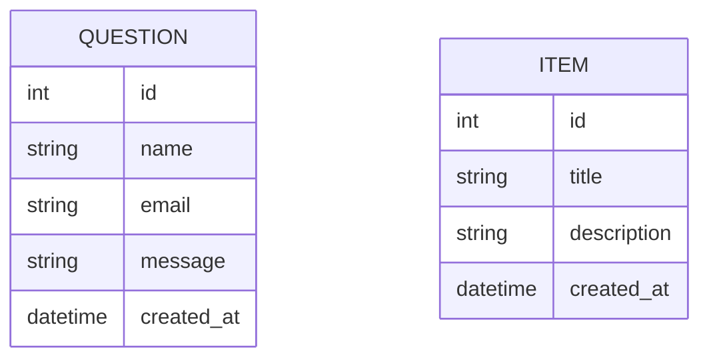

# ER Diagram

## Entities

The current backend data model contains two entities:

- `Question` - the main working entity used for storing contact form submissions
- `Item` - a legacy model left from an earlier API stage and not used by the current frontend

## Diagram

## Notes

- `Question` is the main active model in the project
- `Item` remains in the codebase, but the public API route for it has already been removed
- There is no direct relationship between these two entities
